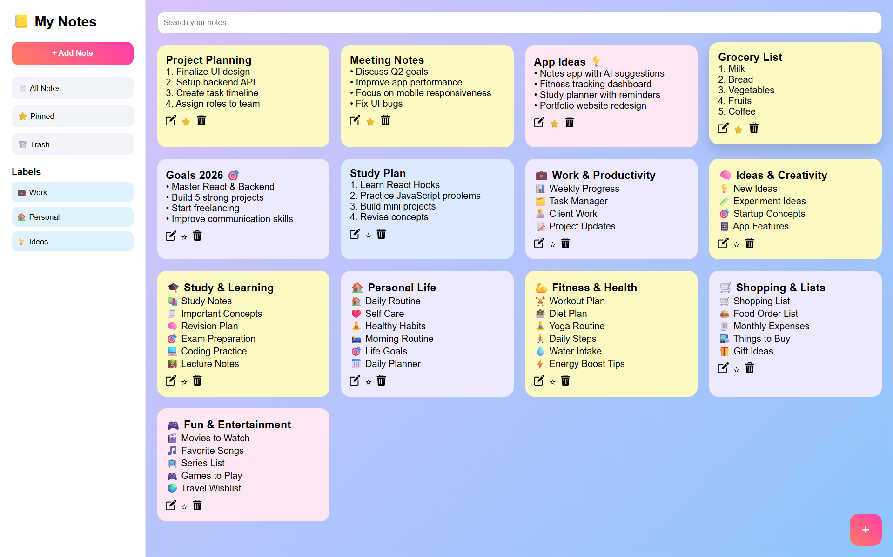
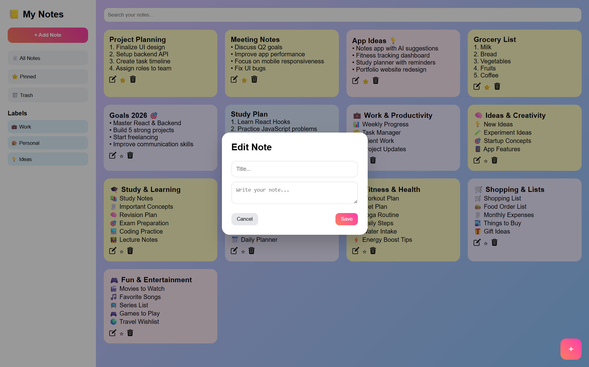
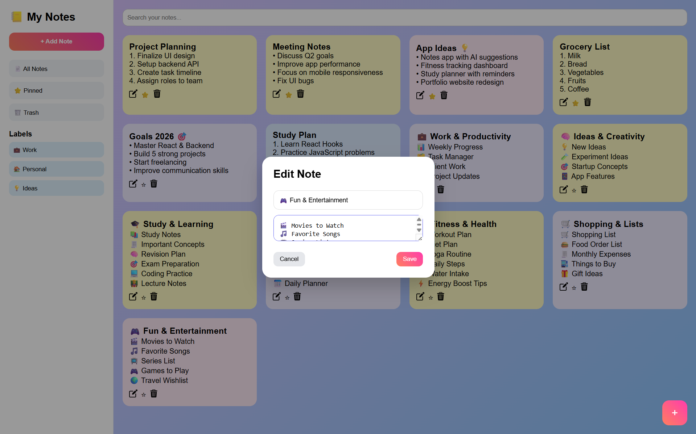
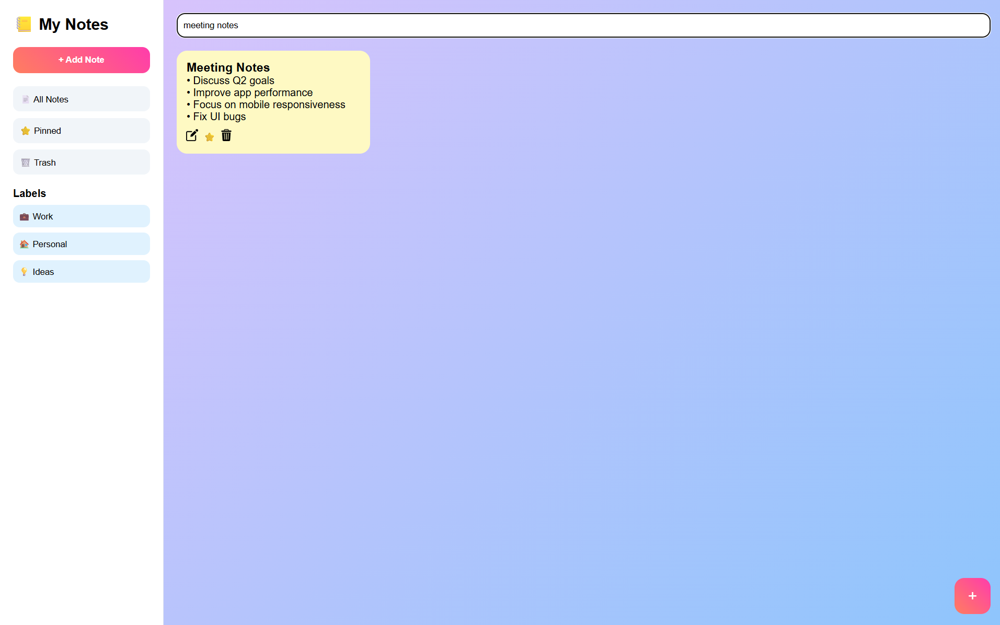

#  Notes App

A modern and user-friendly Notes App built using React. This app allows users to create, edit, delete, and manage notes efficiently.

##  Features

* ✍️ Create new notes
* 📝 Edit existing notes
* 🗑️ Delete notes
* 🔍 Search notes
* 💾 Data stored locally (LocalStorage)
* 📱 Responsive design

## Tech Stack

* React.js
* JavaScript (ES6+)
* CSS
* Vite

## 📸 Screenshots






## 📂 Installation

```bash
git clone https://github.com/rajpatil2372007-jpg/Syntecxhub_notes-app.git
cd Syntecxhub_notes-app
npm install
npm run dev
```

## 🤝 Contributing

Feel free to fork this repo and improve the project!

## 📧 Contact
rajpatil2372007@gmail.com
Rohit Patil
